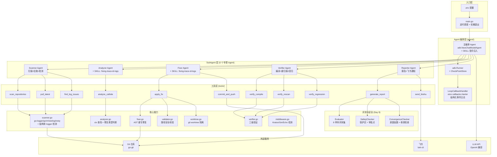
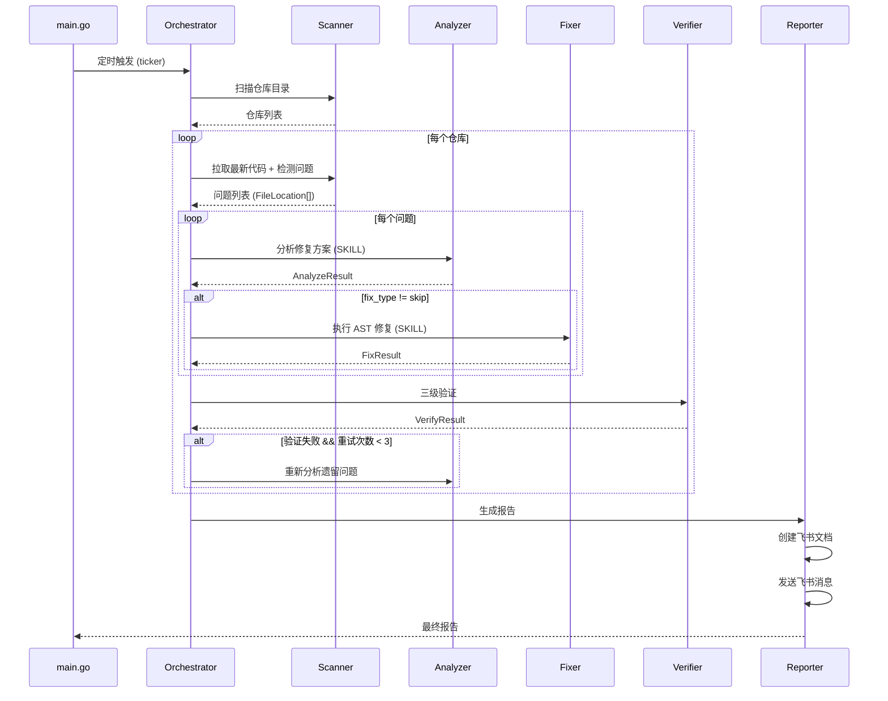
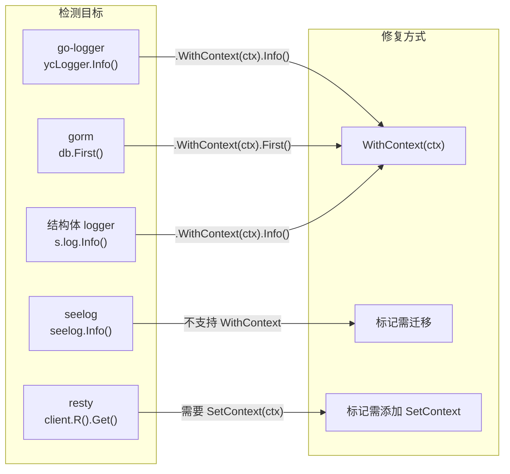
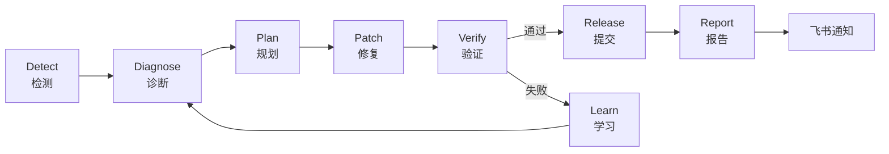

# eino-loop 服务架构图

## 整体架构



## 数据流



## 检测能力矩阵



## Loop Engineering 闭环



## 文件结构

```
eino-loop/
├── main.go                    # 入口：定时调度 + 优雅退出
├── .env                       # 配置文件
├── scripts/
│   └── check-feishu.sh        # 飞书配置校验脚本
├── agent/
│   ├── multiagent.go          # 多 Agent 编排 (ADK + AgentTool)
│   └── callbacks.go           # eino callbacks + checkpoint + 错误分类
├── config/
│   └── config.go              # 配置管理 + 验证
├── prompts/
│   └── system.go              # Agent 指令 + SKILL 加载
├── tools/
│   ├── scanner.go             # 仓库扫描 + 5 类日志检测 + 增量扫描
│   ├── analyzer.go            # 调用点分析 (ctx 查找)
│   ├── fixer.go               # AST 重写修复
│   ├── verifier.go            # 三级验证 (编译/重扫描/回归)
│   ├── reporter.go            # 报告生成 (Markdown)
│   ├── feishu.go              # 飞书文档创建 + 消息发送
│   ├── validator.go           # 路径安全校验
│   ├── worktree.go            # git worktree 隔离
│   ├── middleware.go          # Kratos/Gin/Echo 中间件检测
│   ├── evaluator.go           # 评测集 + 安全门禁 + 收敛检查
│   ├── tools.go               # 工具注册 (11 个 InvokableTool)
│   └── tool_eino.go           # eino 泛型适配器
└── types/
    ├── types.go               # 共享类型
    └── loop.go                # 循环工程核心类型
```
